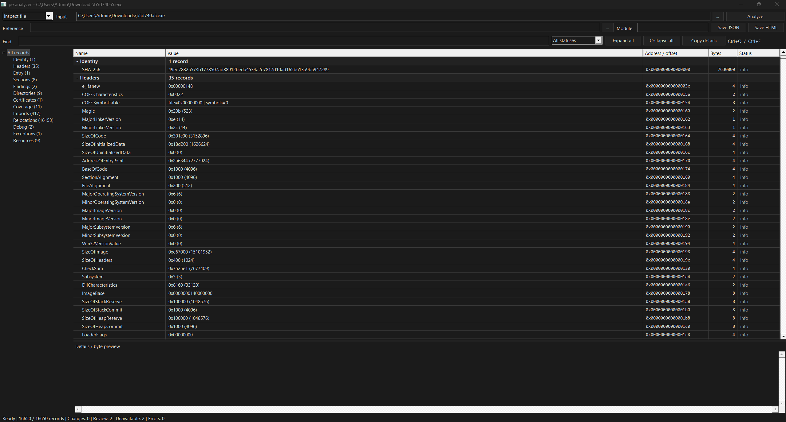

# PE-parser
- PE file inspection and Windows process-memory analysis in C17.
- Parse PE32/PE32+ headers, sections, imports, exports, relocations, resources, and TLS.
- Compare files and inspect loaded modules, modified code, and import pointers.
- Windows GUI and CLI, with JSON and HTML reports.

## Build
Run from the project directory:
```powershell
cmake -S . -B build-x64 -G "Visual Studio 18 2026" -A x64 -DCMAKE_MSVC_RUNTIME_LIBRARY=MultiThreaded -DBUILD_TESTING=ON
cmake --build build-x64 --config Release --parallel
ctest --test-dir build-x64 -C Release --output-on-failure
```

## Usage
Open the GUI:
```
.\build-x64\Release\pe-analyzer-gui.exe
```

Inspect the built executable and create an HTML report:
```
.\build-x64\Release\pe-analyzer.exe inspect .\build-x64\Release\pe-analyzer.exe --html report.html
```

Run the included process-memory demo:
```
python .\tools\demo.py --bin .\build-x64\Release
```

